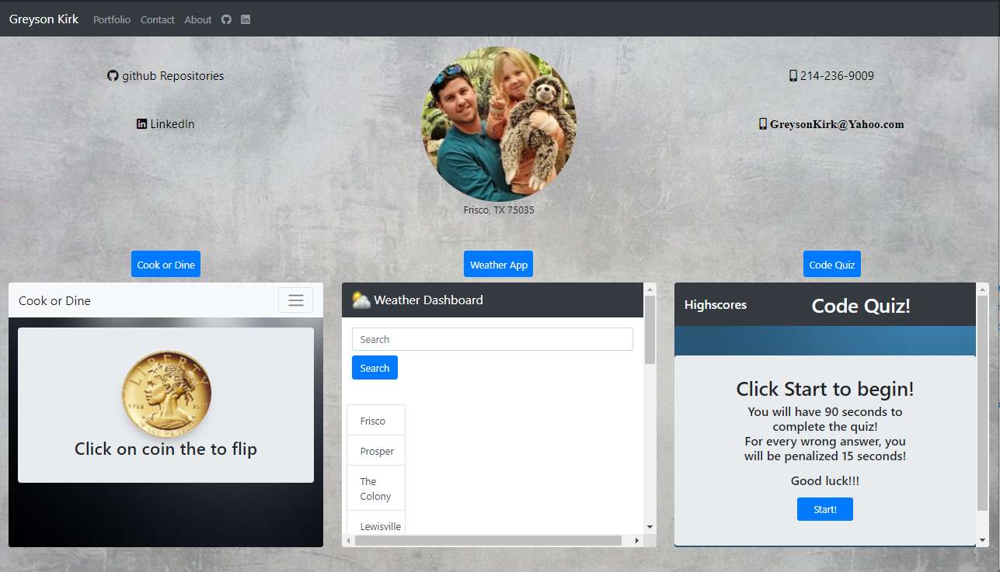

# Portfolio Site

- Repository link: https://github.com/greysonkirk/Portfolio
- Web App link:  https://greysonkirk.github.io/Portfolio/

The purpose of this site is to showcase not only my skills, but projects I have been working on throughout the course.

Within the site, there are three project links, a github link, a linkedIn link, and a download resume button.

As I become better, so will this site.

